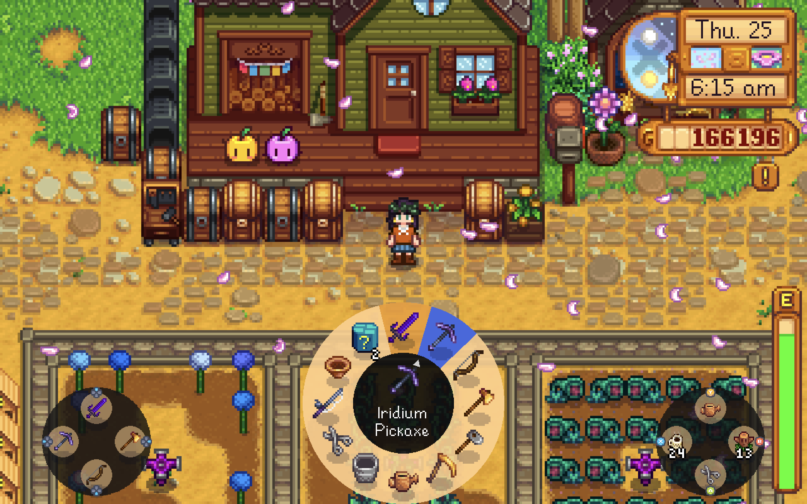

# Star Control - CustomisationPlus for Stardew Valley

This is a fork of focustense/StardewControllers focused on deeper customization and better small-screen usability. The section below highlights what the CustomisationPlus fork adds on top of the original mod, including extra controls for radial menu size, position, and preview layout; item label and description sizing and visibility; quick action visibility and size; and config UI tweaks so the menu fits comfortably on smaller displays like the Steam Deck while staying minimal on larger screens.

This fork also includes a bug fix that resolves the inability to assign a Slingshot to a quick action button (and also works for bows from Swords & Sorcery), plus UI polish like improved text scaling and preserving the vanilla health/stamina/time HUD while the toolbar hides.

You must remove any previous versions of Star Control or Radial Menu before installing this mod.

Screenshot from 1280 x 800 resolution display (Steam Deck native resolution)

https://github.com/user-attachments/assets/6aa94929-b0e4-45aa-a595-359583fe7f70

[ is a mod and framework for replacing Stardew Valley's dated Harvest Moon-style gamepad control scheme with the modal, remappable controls found in modern games, and making the majority of other Stardew mods convenient to interact with using a controller.

Main features include:
- [Pie menus](https://focustense.github.io/StardewControllers/controller-hud/#pie-menus): dynamic radial/wheel style menus for inventory and mod actions that can be navigated with the analog stick;
- [Quick Actions](https://focustense.github.io/StardewControllers/controller-hud/#quick-actions): reassignable one-button actions that are active while the pie menu overlay is open;
- [Instant Actions](https://focustense.github.io/StardewControllers/instant-actions/): reassignable "Zelda-style" one-button actions that be bound to tool swings, melee combat, bomb placement and other in-world actions;
- A complete in-game [configuration system](https://focustense.github.io/StardewControllers/configuration/) for managing all the menus, shortcuts and bindings;
- [Mod API](https://focustense.github.io/StardewControllers/api/) for other mods to register their own actions and custom pages.

## Documentation

User and integrator documentation, including all content on this page, is available at the [Star Control Docs](https://focustense.github.io/StardewControllers/).

## Requirements

Using Star Control - CustomisationPlus requires:

- A valid Stardew Valley install with SMAPI and Stardew UI (see [setup](#setup) below);
- Stardew-compatible gamepad controller, such as any Xbox controller;
- Generic Mod Config Menu (optional but recommended).

## Setup

To get started:

1. Install [SMAPI](https://smapio.io) and set up your game for mods, per the [Modding: Player's Guide](https://stardewvalleywiki.com/Modding:Player_Guide/Getting_Started) instructions.
2. Download and install [Stardew UI](https://github.com/focustense/StardewUI/releases).
3. Download the latest CustomisationPlus release from [Nexus Mods](https://www.nexusmods.com/stardewvalley/mods/40470) or [GitHub](https://github.com/nnnextra/StardewControllers-CustomisationPlus/releases).
4. Open the .zip file and extract the `StarControl` folder into your `Stardew Valley\Mods` folder, or use a mod manager such as Stardrop.
5. Launch the game and load a save.

Refer to the [setup docs](https://focustense.github.io/StardewControllers/#setup) for more information on default controls and the [configuration docs](https://focustense.github.io/StardewControllers/configuration/) for customization.

## Contact

CustomisationPlus fork (maintained by nnnextra):

* GitHub issues: https://github.com/nnnextra/StardewControllers-CustomisationPlus/issues
* GitHub discussions: https://github.com/nnnextra/StardewControllers-CustomisationPlus/discussions
* For bug reports, include clear repro steps and your SMAPI log: https://smapi.io/log

Original mod author (focustense) contact details:

* Create a [GitHub issue](https://github.com/focustense/StardewControllers/issues); for bug reports, be sure to [enable all logging](https://focustense.github.io/StardewControllers/configuration/#debug) and include clear repro steps along with your [SMAPI log](https://smapi.io/log).
* Ping `@focustense` on the [SV Discord](https://discord.com/invite/stardewvalley) or start a thread in `#modded-tech-support`.

## See Also

* [Changelog](CHANGELOG.md)
